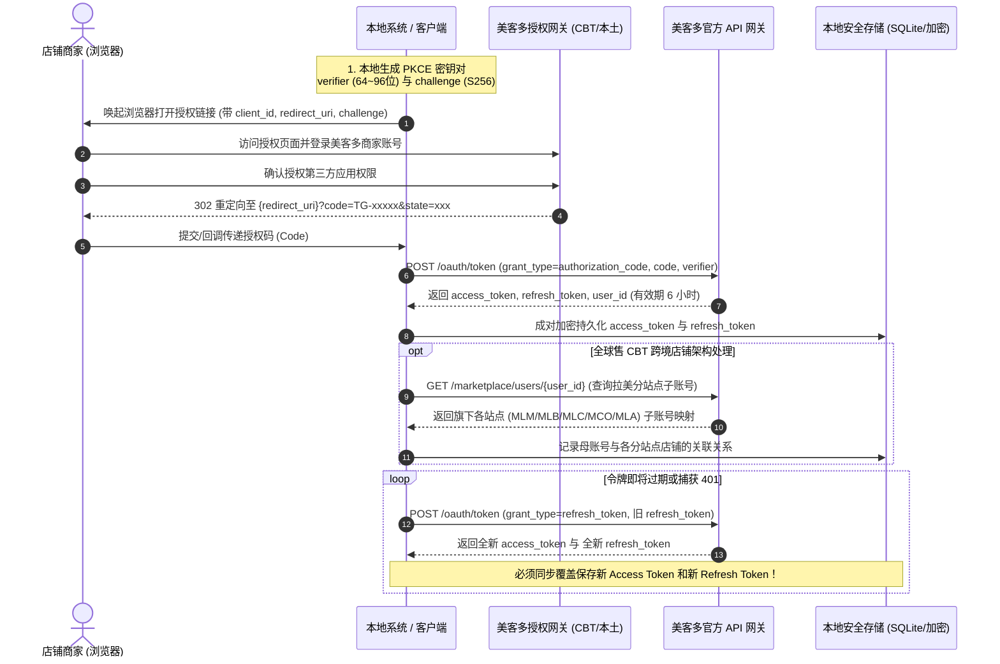

# 美客多 (Mercado Libre) OAuth 2.0 授权与全流程集成技术指南

> 本指南汇总了 Mercado Libre 官方开放平台的标准 OAuth 2.0 授权机制、核心接口参数、生产级业务避坑点以及开箱即用的核心 Python SDK，可直接作为跨项目协作与交付的权威参考。

---

## 一、OAuth 2.0 标准授权时序



---

## 二、核心步骤与请求参数

### 1. 构建授权跳转链接（带 PKCE 推荐）

#### 网关地址区分：
- **全球售 CBT（中国跨境卖家）**：`https://global-selling.mercadolibre.com/authorization`
- **拉美本土卖家（按站点独立网关）**：
  - 墨西哥 (MLM)：`https://auth.mercadolibre.com.mx/authorization`
  - 巴西 (MLB)：`https://auth.mercadolibre.com.br/authorization`
  - 智利 (MLC)：`https://auth.mercadolibre.cl/authorization`
  - 哥伦比亚 (MCO)：`https://auth.mercadolibre.com.co/authorization`
  - 阿根廷 (MLA)：`https://auth.mercadolibre.com.ar/authorization`

#### GET 请求参数清单：
| 参数名 | 必填 | 示例值 | 说明 |
| :--- | :--- | :--- | :--- |
| `response_type` | 是 | `code` | 固定为 code |
| `client_id` | 是 | `3176806962822417` | 美客多开发者后台分配的 App ID |
| `redirect_uri` | 是 | `https://xingtupro1020.com/oauth/callback/` | **必须与开发者后台登记的值完全全等一致**（特别注意包含 `/oauth/callback/` 路径，若缺少 `/oauth/` 将触发 `strictRedirectUriMismatch` 报错拦截） |
| `code_challenge` | 是 | `Base64URL(SHA256(verifier))` | PKCE 动态挑战码（防止授权码被拦截嗅探） |
| `code_challenge_method` | 是 | `S256` | 固定算法 S256 |
| `state` | 是 | `auth_1725518400_abc` | 随机字符串，用于校验回调防 CSRF 跨站攻击 |

---

### 2. 回调获取 Code
商家在浏览器中同意授权后，美客多网关重定向回开发者配置的回调地址：
```http
HTTP/1.1 302 Found
Location: https://{redirect_uri}?code=TG-66d98e1f-xxxx&state=auth_1725518400_abc
```
- **Code 特性**：一次性有效，过期时间约 10 分钟。提取后需立即发起 Token 换取。

---

### 3. Code 换取 Access Token 与 Refresh Token
- **请求地址**：`POST https://api.mercadolibre.com/oauth/token`
- **请求头**：`Content-Type: application/x-www-form-urlencoded`、`Accept: application/json`

#### Form Body 请求体：
```
grant_type=authorization_code&client_id={APP_ID}&client_secret={CLIENT_SECRET}&code={CODE}&redirect_uri={REDIRECT_URI}&code_verifier={CODE_VERIFIER}
```

#### 返回响应示例：
```json
{
  "access_token": "APP_USR-3176806962822417-xxxxxx-xxxxxx",
  "token_type": "Bearer",
  "expires_in": 21600,
  "scope": "offline_access read write",
  "user_id": 3560797046,
  "refresh_token": "TG-66d98e2a-yyyyyy"
}
```
- `expires_in`：固定为 21600 秒（整 6 小时）。
- `user_id`：商家主账号 Seller ID（全球售为母账号 ID）。

---

## 三、生产环境关键业务避坑点

### ⚠️ 避坑点 1：Refresh Token 的“单次消耗性”（必须成对存库）
- **静默刷新请求**：
  ```
  POST https://api.mercadolibre.com/oauth/token
  Content-Type: application/x-www-form-urlencoded

  grant_type=refresh_token&client_id={APP_ID}&client_secret={CLIENT_SECRET}&refresh_token={OLD_REFRESH_TOKEN}
  ```
- **致命陷阱**：
  美客多遵循 OAuth 2.0 严格的 **Refresh Token Rotation (滚动刷新)** 规范。每次刷新成功后，美客多不仅会返回新的 `access_token`，还会生成一个**全新的 `refresh_token`**！
  - **旧的 `refresh_token` 在被调用的瞬间直接永久作废**。
  - **避坑准则**：数据库中必须使用原子事务，同时更新并覆盖 `access_token` 与 `refresh_token`。如果只存了 `access_token` 而把旧的 `refresh_token` 留着，6 小时后下一次刷新必定报 `HTTP 400 invalid_grant`，导致店铺直接掉线且必须重新人工扫码授权！
- **推荐策略**：在 Token 过期前 15~30 分钟主动静默刷新；或在捕获到 401 Unauthorized 时拦截重试一次刷新。

---

### ⚠️ 避坑点 2：全球售 (CBT) 的“母子账号架构”
中国跨境卖家在美客多并非单一店铺，而是**一个母账号挂载多个拉美分站点子账号**：
1. **母账号 ID (Seller ID)**：
   授权成功时返回的 `user_id`（如 `3560797046`）是 CBT 母账号，不能直接用于具体站点的商品上架或拉取。
2. **获取拉美分站点子账号**：
   ```http
   GET https://api.mercadolibre.com/marketplace/users/{parent_seller_id}
   Authorization: Bearer {access_token}
   ```
   返回数据中会包含该母账号下绑定的具体站点店铺列表（例如墨西哥 MLM、巴西 MLB、智利 MLC、哥伦比亚 MCO 等）以及各站点的 `child_user_id`。
3. **真实业务操作对应的 API 路径**：
   - **拉取分站点活动商品**：`GET /marketplace/users/{child_user_id}/items/search?search_type=scan`
   - **查询分站点商品详情**：`GET /marketplace/items/{child_item_id}`
   - **彻底下架/删除商品**：`PUT /global/items/{child_item_id}` 带 `{"deleted": true}`（秒级生效，避免跨站点锁定）。

---

### ⚠️ 避坑点 3：授权页面报 "Sorry, the application cannot connect to your account"
如果在打开授权网址时，浏览器直接显示此错误，排查清单如下：
1. **Redirect URI 字符未严格对齐**：
   - 开发者后台登记的 `redirect_uri` 与代码发送的 `redirect_uri` 必须百分之百一致。
   - 常见失误：后台填的是 `https://example.com/callback`，而代码传的是 `https://example.com/callback/`（带斜杠与不带斜杠被视为不同地址）。
2. **网关类型不匹配（CBT 还是 本土店）**：
   - 本土店账号（如在墨西哥当地注册的卖家号）去访问全球售网关 `global-selling.mercadolibre.com` 会被拒绝；
   - 同样，中国跨境 CBT 账号去访问 `auth.mercadolibre.com.mx` 也会被拒绝。
3. **浏览器登录状态**：
   - 当前浏览器如果没有登录任何美客多卖家后台，或者登录了个人买家账号，会导致授权上下文缺失。

---

## 四、开箱即用的 Python 核心 SDK 代码

> 以下代码采用原生 Python 3 标准库（`urllib`, `hashlib`, `secrets` 等）编写，无任何第三方依赖，直接嵌入即可在任何 Python 3.9+ 环境中生产运行：

```python
"""美客多 (Mercado Libre) OAuth 2.0 官方标准客户端 SDK
包含：PKCE 生成、CBT/本土站授权链接构建、Code换取Token、Token自动刷新与错误处理
"""

import base64
import hashlib
import json
import secrets
import time
import urllib.error
import urllib.parse
import urllib.request
from typing import Any, Dict, Tuple


class MeliOAuthClient:
    API_BASE = "https://api.mercadolibre.com"

    GATEWAYS = {
        "cbt": "https://global-selling.mercadolibre.com",
        "MLM": "https://auth.mercadolibre.com.mx",
        "MLB": "https://auth.mercadolibre.com.br",
        "MLC": "https://auth.mercadolibre.cl",
        "MCO": "https://auth.mercadolibre.com.co",
        "MLA": "https://auth.mercadolibre.com.ar",
    }

    def __init__(self, app_id: str, client_secret: str, redirect_uri: str, gateway: str = "cbt"):
        """
        :param app_id: 美客多开发者后台 App ID (Client ID)
        :param client_secret: 美客多开发者后台 Client Secret
        :param redirect_uri: 必须与后台完全一致的回调地址
        :param gateway: 授权网关标识，默认 cbt (跨境全球售)，本土店可选 MLM, MLB, MLC 等
        """
        self.app_id = str(app_id).strip()
        self.client_secret = str(client_secret).strip()
        self.redirect_uri = str(redirect_uri).strip()
        self.auth_base = self.GATEWAYS.get(gateway, self.GATEWAYS["cbt"])

    def generate_auth_url(self, state: str = "") -> Tuple[str, str]:
        """
        生成带有 PKCE (S256) 安全校验的授权链接与本地 code_verifier
        :return: (auth_url, code_verifier)
        """
        verifier = secrets.token_urlsafe(64)[:96]
        digest = hashlib.sha256(verifier.encode("utf-8")).digest()
        challenge = base64.urlsafe_b64encode(digest).decode("utf-8").rstrip("=")

        params = {
            "response_type": "code",
            "client_id": self.app_id,
            "redirect_uri": self.redirect_uri,
            "state": state or f"auth_{int(time.time())}",
            "code_challenge": challenge,
            "code_challenge_method": "S256",
        }
        query = urllib.parse.urlencode(params)
        auth_url = f"{self.auth_base}/authorization?{query}"
        return auth_url, verifier

    def exchange_code_for_token(self, code: str, code_verifier: str = "") -> Tuple[bool, Dict[str, Any], str]:
        """
        使用商家授权后返回的 Code 换取 Access Token 与 Refresh Token
        :return: (is_success, payload_dict, error_message)
        """
        body = {
            "grant_type": "authorization_code",
            "client_id": self.app_id,
            "client_secret": self.client_secret,
            "code": str(code).strip(),
            "redirect_uri": self.redirect_uri,
        }
        if code_verifier:
            body["code_verifier"] = str(code_verifier).strip()

        return self._post_token(body)

    def refresh_token(self, current_refresh_token: str) -> Tuple[bool, Dict[str, Any], str]:
        """
        使用现有的 Refresh Token 静默刷新 Access Token
        ⚠️ 注意：每次刷新成功后，美客多会发放全新的 refresh_token，旧的立即失效！
        调用方必须同时把返回的 access_token 和 refresh_token 保存到数据库！
        """
        body = {
            "grant_type": "refresh_token",
            "client_id": self.app_id,
            "client_secret": self.client_secret,
            "refresh_token": str(current_refresh_token).strip(),
        }
        return self._post_token(body)

    def _post_token(self, body_params: dict) -> Tuple[bool, Dict[str, Any], str]:
        data = urllib.parse.urlencode(body_params).encode("utf-8")
        req = urllib.request.Request(
            f"{self.API_BASE}/oauth/token",
            data=data,
            headers={
                "Content-Type": "application/x-www-form-urlencoded",
                "Accept": "application/json",
            },
            method="POST",
        )
        try:
            with urllib.request.urlopen(req, timeout=15) as resp:
                result = json.loads(resp.read().decode("utf-8"))
                return True, result, ""
        except urllib.error.HTTPError as e:
            raw_err = e.read().decode("utf-8", errors="replace")
            try:
                err_json = json.loads(raw_err)
                err_desc = err_json.get("message") or err_json.get("error") or raw_err
            except Exception:
                err_desc = raw_err
            return False, {}, f"HTTP {e.code}: {err_desc}"
        except Exception as e:
            return False, {}, str(e)
```
